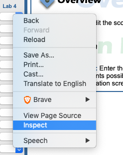
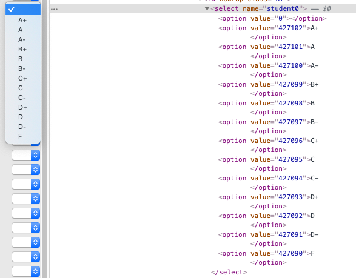
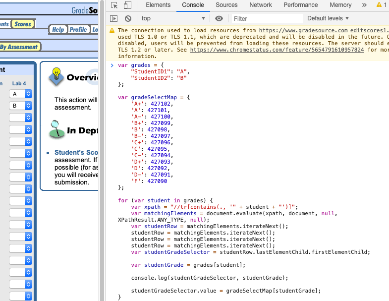

# Gradesource automatic grade selector

This is a tool that will prevent you from having to manually select a grade for each student in your class on gradesource.

There are a few steps involved:

1. Download this repository to your machine.
2. Go to your class' gradesource page > click the "Scores" tab > click the "Edit" link for any of the assignments/tests.
You should now be at the screen where you used to manually enter your grades.
3. Next, right click one of the dropdown selectors and click inspect.

4. Then note down the keys and values you see in the html source of the dropdown selector.

5. Replace the keys and values of "gradeSelectMap" in auto-select-grades.js with the keys and values you noted down. 

6. Next, you'll need to add your students' grades to the "grades" variable in auto-select-grades.js. 
(If your data is in a spreadsheet, save it as a CSV file in the "data" directory and use "main.py" in "csv_to_json" to convert it to the appropriate json format. Make sure to read the "NOTE" comments in main.py) 

7. Now copy the entire contents of auto-select-grades.js > Go to the gradesource page with the grade selectors > Right click > Click inspect > Click the "Console" tab in the inspection window > Paste the contents of auto-select-grades.js > Hit enter

8. The grades should now automatically be selected for all students whom you added to the "grades" variable in auto-select-grades.js > Click "Submit"
